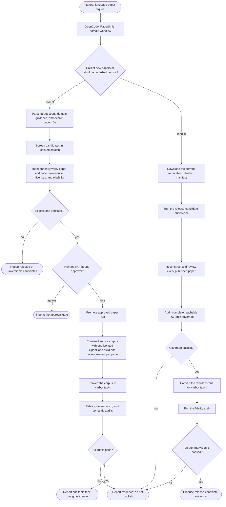

# paperbench-harbor

`paperbench-harbor` builds, verifies, releases, and maintains Harbor task
datasets for paper-writing agents. It is the maintainer repository, not the
canonical end-user manual for a released benchmark.

## Published datasets

| Dataset | Role | Canonical documentation |
|---|---|---|
| [Paper-Writing-Exam](https://huggingface.co/datasets/Jack-Jieke-Wu/Paper-Writing-Exam) | Runnable Harbor tasks | Task selection, material boundary, running, and version pinning |
| [Paper-Writing-Exam-Trials](https://huggingface.co/datasets/Jack-Jieke-Wu/Paper-Writing-Exam-Trials) | Sanitized agent trajectories and results | Trajectory schema, retrieval, and analysis limits |
| [Paper-Writing-Exam-Source-Archive](https://huggingface.co/datasets/Jack-Jieke-Wu/Paper-Writing-Exam-Source-Archive) | Immutable task-paper registry and construction inputs | Provenance lookup and source-archive licensing |

The task dataset is the only dataset a Harbor evaluation runs. Trial data is
evidence about an evaluation; it is not a replacement task dataset or training
corpus. The source archive is for provenance and independent review only; no
Harbor task may read it at runtime.

## Maintainer documentation

- [Dataset versioning](docs/dataset-versioning.md): release records, immutable
  revisions, and source-archive publication.
- [Documentation inventory](docs/documentation-inventory.md): ownership and
  current status of every repository document.
- [Fidelity audit](docs/fidelity-audit.md): source-to-task validation rules.
- [LifeSci construction](docs/lifesci-paperrecon-construction.md): PaperSmith
  build and validation path.
- [Trial exporter maintenance](docs/trial-dataset.md): sanitize and publish
  trial records without exposing private task material.
- [Architecture](docs/papersmith-architecture.md): the construction core and
  domain-plugin contracts.

For task execution, configuration-specific materials, and trajectory analysis,
use the dataset cards linked above. GitHub keeps only the construction and
maintenance contracts so a release does not create two competing user manuals.

## OpenCode workflows

The repository has two human-gated OpenCode entry points. They orchestrate
screening, verification, and evidence collection but cannot directly edit the
repository or bypass a required audit. The converting and publishing programs
remain deterministic, separately auditable maintainer commands.

### Onboard an existing benchmark

`benchmark-onboard` evaluates a public, fixed benchmark for Harbor packaging.
It stops at a SHA-bound human approval; only then may a release operator
materialize and audit the approved layout.


### Build tasks from papers

`papersmith-lifesci` is the current LifeSci implementation of the PaperSmith
paper-to-task pipeline. Its same screening, human approval, construction,
conversion, and audit contracts are intended for domain plugins, so the pattern
can serve future Physics, Chemistry, Mathematics, and other paper corpora.



These workflows establish task-construction correctness only. They do not score
or make claims about the performance of a paper-writing agent.

## Benchmark families

The current task release has four configurations:

- `paperwrite-bench-short`: Harbor adaptation of PaperWrite-Bench.
- `paperwritingbench-sparse-plotoff`: Harbor adaptation of PaperWritingBench.
- `lifesci-paperrecon-short`: PaperSmith-built LifeSci paper reconstruction
  tasks.
- `hello-world`: a first-party integration smoke task, not a source-paper
  benchmark.

The precise task counts, release revision, compatibility notes, and task IDs
are maintained in the [Paper-Writing-Exam dataset card](https://huggingface.co/datasets/Jack-Jieke-Wu/Paper-Writing-Exam).

## Build and verify

Install the development dependencies and run the repository checks:

```bash
uv sync --all-extras
uv run --all-extras pytest -q
uv run --all-extras ruff check .
```

Build a source-only provenance archive from a fixed task release and retained
upstream inputs:

```bash
uv run --all-extras python scripts/build_source_archive.py \
  --release-root <immutable-task-release-tree> \
  --output-dir <source-archive-staging-dir> \
  --dataset-repo Jack-Jieke-Wu/Paper-Writing-Exam \
  --dataset-revision <immutable-task-revision> \
  --converter-revision <paperbench-harbor-revision> \
  --paperwrite-source <paperwrite-bench-source> \
  --paperwritingbench-source <paperwritingbench-source> \
  --lifesci-source <lifesci-source-corpus> \
  --config hello-world \
  --config paperwrite-bench-short \
  --config paperwritingbench-sparse-plotoff \
  --config lifesci-paperrecon-short
```

The command writes a registry and original-source archive but never copies a
Harbor task, solution, verifier, or trial into that archive. Re-run it with
`--verify-only --output-dir <source-archive-staging-dir>` before publishing.

## License and security boundaries

Upstream benchmark data, paper sources, code, and conference templates retain
their original licenses. Source archives record the relevant terms and fixed
locations; they do not grant a new redistribution license.

Benchmark task data, verifier-private material, credentials, and unredacted
agent output must never be included in training corpora or published by a
maintenance workflow unless its dedicated policy explicitly permits it.
