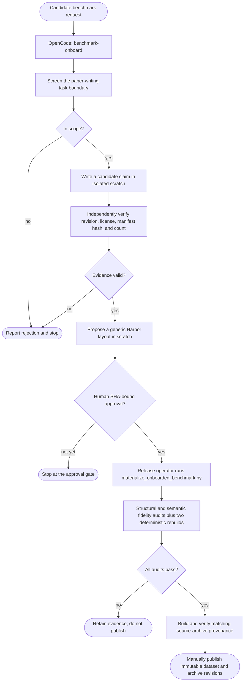
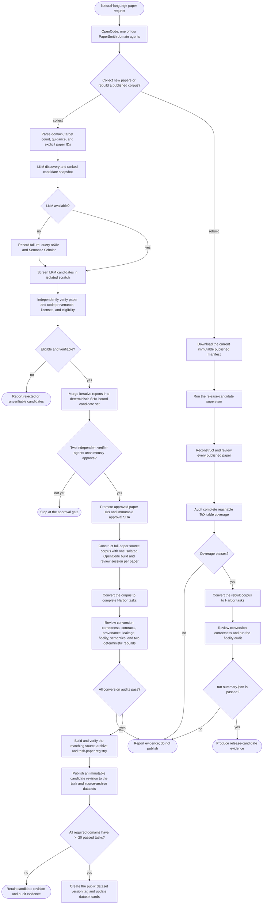

# paperbench-harbor

`paperbench-harbor` builds, verifies, releases, and maintains Harbor task
datasets for paper-writing agents. It is the maintainer repository, not the
canonical end-user manual for a released benchmark.

## Published datasets

| Dataset | Role | Canonical documentation |
|---|---|---|
| [Paper-Writing-Exam](https://huggingface.co/datasets/Jack-Jieke-Wu/Paper-Writing-Exam) | Runnable Harbor tasks | Task selection, material boundary, running, and version pinning |
| [Paper-Writing-Exam-Trials](https://huggingface.co/datasets/Jack-Jieke-Wu/Paper-Writing-Exam-Trials) | Sanitized agent trajectories and results | Trajectory schema, retrieval, and analysis limits |
| [Paper-Writing-Exam-Source-Archive](https://huggingface.co/datasets/Jack-Jieke-Wu/Paper-Writing-Exam-Source-Archive) | Immutable task-paper registry and construction inputs | Provenance lookup and source-archive licensing |

The task dataset is the only dataset a Harbor evaluation runs. Trial data is
evidence about an evaluation; it is not a replacement task dataset or training
corpus. The source archive is for provenance and independent review only; no
Harbor task may read it at runtime.

## Maintainer documentation

- [Dataset versioning](docs/dataset-versioning.md): release records, immutable
  revisions, and source-archive publication.
- [Documentation inventory](docs/documentation-inventory.md): ownership and
  current status of every repository document.
- [Fidelity audit](docs/fidelity-audit.md): source-to-task validation rules.
- [LifeSci construction](docs/lifesci-paperrecon-construction.md): PaperSmith
  build and validation path.
- [Trial exporter maintenance](docs/trial-dataset.md): sanitize and publish
  trial records without exposing private task material.
- [Architecture](docs/papersmith-architecture.md): the construction core and
  domain-plugin contracts.

For task execution, configuration-specific materials, and trajectory analysis,
use the dataset cards linked above. GitHub keeps only the construction and
maintenance contracts so a release does not create two competing user manuals.

## OpenCode workflows

The repository has two OpenCode entry points. They orchestrate screening,
verification, and evidence collection but cannot directly edit the repository
or bypass a required audit. Existing-benchmark onboarding retains its explicit
human SHA gate; PaperRecon candidate selection uses two independent verifier
agents. The converting and publishing programs remain deterministic,
separately auditable maintainer commands.

### Onboard an existing benchmark

`benchmark-onboard` evaluates a public, fixed benchmark for Harbor packaging.
It stops at a SHA-bound human approval; only then may a release operator
materialize and audit the approved layout.



### PaperRecon domain onboarding and release

The paper-to-dataset workflow is named `paperrecon-domain-release`. It starts
from a paper request and ends with an immutable Hugging Face candidate revision
or, only after the release gate passes for all required domains, a public
versioned dataset. `run_paperrecon_domain.py` implements the discovery through
candidate-staging stages; publication and version tagging are deliberate release
operator stages rather than implicit side effects of a build command.

PaperSmith has four paper-to-task agents: `papersmith-lifesci`,
`papersmith-physics`, `papersmith-chemistry`, and `papersmith-mathematics`.
They share a public-materials-to-paper-reconstruction protocol while retaining
domain-specific screening policies and writing instructions. PaperSmith invokes
Harbor's LKM adapter through the official `bohr lkm search` command and records
the normalized result in `discovery.json`. The screening agent must consume that
snapshot rather than calling a raw Bohrium endpoint or requiring
`BOHR_ACCESS_KEY`. LKM improves recall and ranking, but never establishes
source, license, code, or reconstructability facts; those remain authoritative
arXiv/e-print/GitHub checks.



These workflows establish task-construction correctness only. They do not score
or make claims about the performance of a paper-writing agent.

For Physics, Chemistry, and Mathematics, a domain is not ready for public
release until it has at least 20 independent-verifier-approved, fully rebuilt tasks that pass
the same conversion, fidelity, determinism, and semantic audits. Candidate
revisions are review artifacts identified by immutable SHAs, not public version
tags.

For a new PaperRecon domain, merge iterative reports before review:

```bash
uv run --all-extras python scripts/consolidate_paperrecon_candidates.py \
  --domain chemistry \
  --report <screen-run-1>/candidates.json \
  --report <screen-run-2>/candidates.json \
  --output <run>/candidate-set.json \
  --minimum 20 --reserve 5
```

Then run two isolated verifier agents with distinct models. Promotion accepts
only the resulting SHA-bound `agent-approval.json`.

```bash
uv run --all-extras python scripts/verify_paperrecon_candidates.py \
  --domain chemistry --candidates <run>/candidate-set.json \
  --run-root <run>/verifier --minimum-approved 20
```

Once the approval manifest exists, the domain runner performs the remaining
local stages and writes a candidate release report:

```bash
uv run --all-extras python scripts/run_paperrecon_domain.py \
  --domain chemistry --run-root <run> \
  --candidates <run>/candidate-set.json \
  --agent-approval <run>/verifier/agent-approval.json \
  --promote --build --convert --audit --stage-candidate
```

The release operator then validates the staged task tree and source archive
with the release workflow. The cross-domain publisher is the only command that
uploads staged bytes: it first requires Physics, Chemistry, and Mathematics to have at least 20
passed, deterministic, semantically reviewed tasks, then records immutable
tree digests on a candidate Hub revision. It never creates a public tag unless
`--publish` is supplied.

```bash
uv run --all-extras python scripts/publish_paperrecon_release.py \
  --physics-run <physics-run> \
  --chemistry-run <chemistry-run> --mathematics-run <mathematics-run> \
  --candidate-revision paperrecon-v0.5.0-candidate \
  --evidence <release-dir>/paperrecon-gate.json

# After reviewing the immutable candidate revision:
uv run --all-extras python scripts/publish_paperrecon_release.py \
  --physics-run <physics-run> \
  --chemistry-run <chemistry-run> --mathematics-run <mathematics-run> \
  --candidate-revision paperrecon-v0.5.0-candidate \
  --evidence <release-dir>/paperrecon-gate.json --publish
```

The public `v0.5.0` tag is created only after the cross-domain gate passes;
candidate revisions are never silently promoted by a build command.

## Benchmark families

The current published task release has four configurations:

- `paperwrite-bench-short`: Harbor adaptation of PaperWrite-Bench.
- `paperwritingbench-sparse-plotoff`: Harbor adaptation of PaperWritingBench.
- `lifesci-paperrecon-short`: PaperSmith-built LifeSci paper reconstruction
  tasks.
- `hello-world`: a first-party integration smoke task, not a source-paper
  benchmark.

The next candidate-release generation adds `physics-paperrecon-short`,
`chemistry-paperrecon-short`, and `mathematics-paperrecon-short`. They remain
unpublished until their 20-task per-domain acceptance gates have passed.

The precise task counts, release revision, compatibility notes, and task IDs
are maintained in the [Paper-Writing-Exam dataset card](https://huggingface.co/datasets/Jack-Jieke-Wu/Paper-Writing-Exam).

## Build and verify

Install the development dependencies and run the repository checks:

```bash
uv sync --all-extras
uv run --all-extras pytest -q
uv run --all-extras ruff check .
```

Build a source-only provenance archive from a fixed task release and retained
upstream inputs:

```bash
uv run --all-extras python scripts/build_source_archive.py \
  --release-root <immutable-task-release-tree> \
  --output-dir <source-archive-staging-dir> \
  --dataset-repo Jack-Jieke-Wu/Paper-Writing-Exam \
  --dataset-revision <immutable-task-revision> \
  --converter-revision <paperbench-harbor-revision> \
  --paperwrite-source <paperwrite-bench-source> \
  --paperwritingbench-source <paperwritingbench-source> \
  --lifesci-source <lifesci-source-corpus> \
  --physics-source <physics-source-corpus> \
  --chemistry-source <chemistry-source-corpus> \
  --mathematics-source <mathematics-source-corpus> \
  --config hello-world \
  --config paperwrite-bench-short \
  --config paperwritingbench-sparse-plotoff \
  --config lifesci-paperrecon-short \
  --config physics-paperrecon-short \
  --config chemistry-paperrecon-short \
  --config mathematics-paperrecon-short
```

The command writes a registry and original-source archive but never copies a
Harbor task, solution, verifier, or trial into that archive. Re-run it with
`--verify-only --output-dir <source-archive-staging-dir>` before publishing.

## License and security boundaries

Upstream benchmark data, paper sources, code, and conference templates retain
their original licenses. Source archives record the relevant terms and fixed
locations; they do not grant a new redistribution license.

Benchmark task data, verifier-private material, credentials, and unredacted
agent output must never be included in training corpora or published by a
maintenance workflow unless its dedicated policy explicitly permits it.
